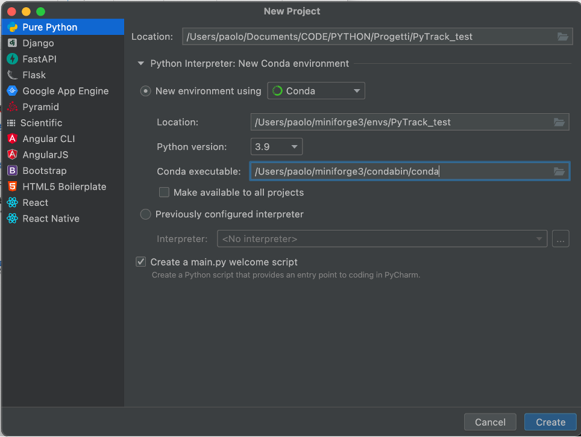

PyTrack for dummies
===============

Setup of the environment on M1 processor
------------

**Step 1**
Install ``Miniforge`` (minimal installer for Conda specific to conda-forge) using this `Link <https://github.com/conda-forge/miniforge#download>`_.

**Step 1.1.1** install xcode:

.. code-block:: shell

    xcode-select –install

**Step 1.1.2**
install MiniForge by terminal:

.. code-block:: shell

    Miniforge3-MacOSX-arm64.sh

Select ``no`` to conda init

.. note::
    Follow this `guide <https://betterprogramming.pub/how-to-install-pytorch-on-apple-m1-series-512b3ad9bc6>`_ for a more detailed description of the various steps.

**Step 2**
Install Python 3.9.13 (if you don’t have any other version later than 3.X) from this `link <https://www.python.org/downloads/release/python-3913/>`_ by downloading ``macOS 64-bit universal2 installer``.

**Step 3** Set a project in PyCharm using the ``New project`` button.

**Step 4** Install Pytrack, from terminal in PyCharm, using the following command:

.. code-block:: shell

    conda install pytrack

Perform map-matching process
------------
**Step 1**
Download the ``dataset.xlsx`` file and the notebook file ``map-matching.ipynb`` from the official GitHub repository of this library.
This Jupyter file permits you to test the map matching, whilst, the ``dataset.xlsx`` file lists a set of gps positions.

**Step 2**
Double click on the Jupyter file directly in PyCharm, and then ``Run all`` (double green arrows)

.. note::
    The ``openpyxl`` library is required to execute the code. If it is not already installed, it can be installed with the following terminal command:

    .. code-block:: shell

        conda install openpyxl

    The results can be inspected directly in the jupyter notebook.

Make a video of the reconstructed path
------------

**Step 1**
Go to the `official GitHub repository <_https://github.com/cosbidev/PyTrack>`_ of this library, download the code and pick the Jupyter file ``create_video_path.ipynb`` located in the ``examples`` folder.

**Step 2**
Open the same project of ``Perform map-matching process`` tutorial and paste ``create_video_path.ipynb`` in the working directory.
Please check to have there the same ``dataset.xlsx`` used in the previous tutorial.

**Step 3**
Go to this `link <https://developers.google.com/maps/documentation/streetview/overview>`_ and click on ``Get started`` button (upper right corner) and log in.
You can use the free credit offered by Google, which usually consists of 200$ each month free of charge for Google Maps API.
At the end of the registration please save your key for API Google Maps Platform.
In Google Cloud resume, clink on the API menu in the left and check that the ``Street View Static API`` has been enabled.

**Step 4**
Open the ``create_video_path.ipynb`` file and insert your key for API Google Maps Platform in line 2 of cell 3.

**Step 5**
Check if you already have the libraries needed to run this example, but not needed to run pytrack.
To this end, check the libraries listed from rows 4 to 19 of cell 1. In the example below, I need to install natsort, tqdm, cv2 (i.e. OpenCV) .
I can do that from PyCharm terminal, typing:

.. code-block:: shell

    conda install natsort
    conda install tqdm
    pip install opencv-contrib-python

**Step 6**
Run the code, and you will find the following results: a) in the working directory, in the new created folder ``SV_panoramas``:
you will have a folder for each Street View Image, each containing the image and the metadata.
In this example you have 346 folders, from 0 to 345; b) the output video, concatenating the images in SV_panoramas, is located in the working directory.
